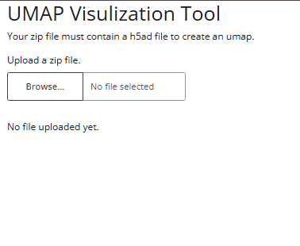
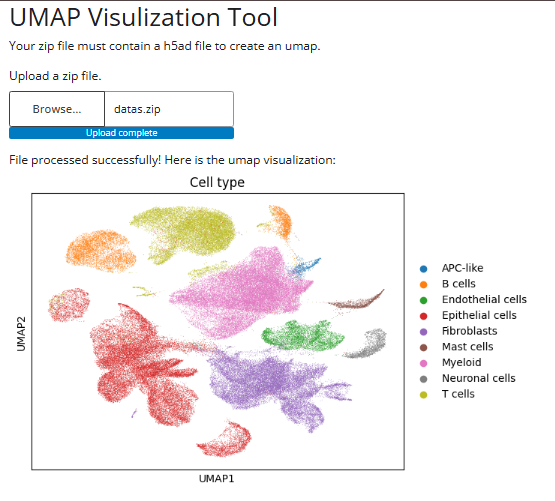

# Umap Visualization Tool

### Overview
A web application built with Shiny for Python that allows users to create UMAP visualizations from a .h5ad file inside a .zip folder.

### Features
- A simple and understable design.
- Extracts the .zip file that contains .h5ad file and processess.
- Displays the UMAP visulization.

### Requirements
- Python 3.x
- Libraries: 
    * Scanpy
    * Shiny
    * Matplotlib
    * Os
    * Zipfile
    * Tempfile

### Usage 
1. **Clone the repository.**
```
git clone https://github.com/MelisCakan/single-cell-umap-visulization
```
2. **Install the libraries.**
```
pip install -r requirement.txt
```
3. **Run the app**
```
python main.py
```
4. **Open the provided local URL in a web browser to access the web application.**

### How The Web Application Works
1. User uploads a .zip file that contains a .h5ad file.
2. The application extracts it, gets the .h5ad file. Then processes the file to create the UMAP visualization.
3. After some time, the UMAP Visualization is being displayed.

### How The Web Application Looks Like

#### Before The Data

#### After The Data

### License
This project is licensed under the MIT License.